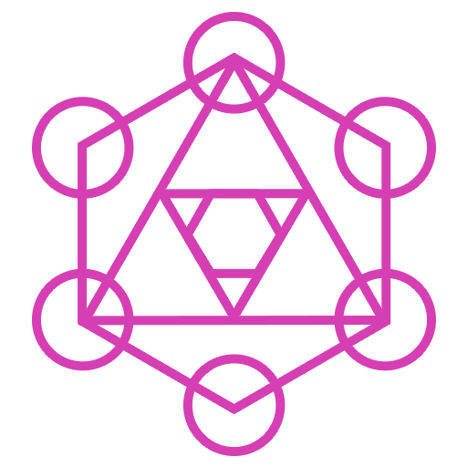
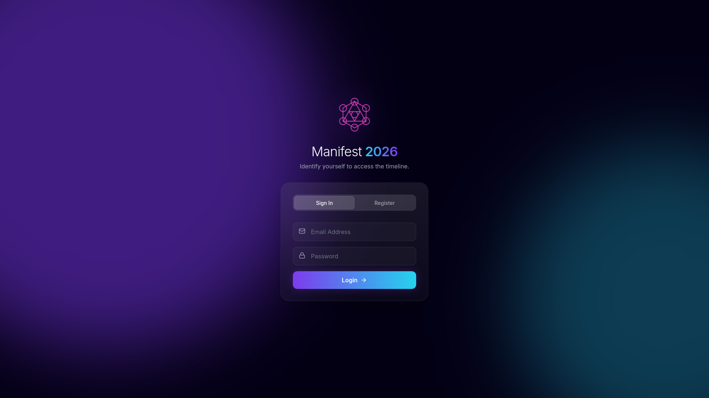
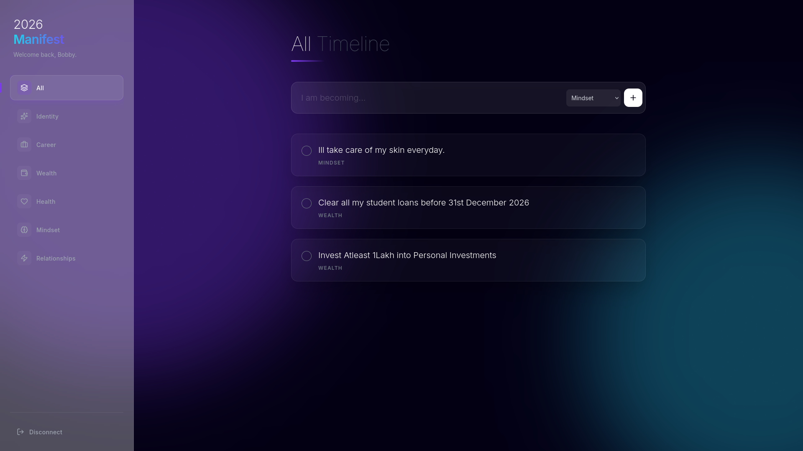

<div align="center">

  

  # 🌌 Manifest 2026

  **"Design your future self."**
  
  <p>
    <a href="https://manifest-26.bobby-anthene.me">View Live Demo</a> •
    <a href="https://github.com/noturbob/manifestation-26/issues">Report Bug</a> •
    <a href="https://github.com/noturbob/manifestation-26/pulls">Request Feature</a>
  </p>
  
  [](https://skillicons.dev)

</div>

<br />

---

## 🔮 About The Project

**Manifest 2026** is not just a todo list; it is a **Cinematic Affirmation Dashboard**. Built to replace boring productivity tools with an immersive, emotional experience, it combines high-performance engineering with the aesthetic philosophy of **Spatial Design** and **Glassmorphism**.

The interface features deep blurs, physics-based motion (parallax tilt), and ambient lighting to create a "flow state" for the user.

### ✨ Key Features

* **🎨 Cinematic UI:** Glassmorphism 2.0 with noise textures, backdrop filters, and ambient glowing gradients.
* **💫 Physics Animation:** Cards respond to mouse movement using **Framer Motion** parallax effects.
* **📱 Fully Responsive:** Adaptive layout with a custom mobile drawer and touch-optimized interactions.
* **🔐 Secure Core:** JWT-based authentication with bcrypt encryption and protected API routes.
* **⚡ Optimistic UI:** Instant state updates powered by **Zustand** for a lag-free experience.
* **🌍 Dual Domain Support:** Configured for both Vercel and custom domain routing via CORS.

---

## 🛠️ Architecture

This project operates as a **Monorepo** containing both the client and server.

| Component | Tech Stack |
| :--- | :--- |
| **Frontend** | React, TypeScript, Tailwind CSS, Framer Motion, Lucide Icons |
| **Backend** | Node.js, Express, MongoDB (Mongoose), JWT, Bcrypt |
| **Deploy** | Vercel (Frontend), Render (Backend) |

---

## 🚀 Getting Started

Follow these steps to set up the portal locally.

### Prerequisites

* Node.js (v18+)
* MongoDB Atlas Account

### Installation

1.  **Clone the Repo**
    ```bash
    git clone [https://github.com/noturbob/manifestation-26.git](https://github.com/noturbob/manifestation-26.git)
    cd manifestation-26
    ```

2.  **Setup Backend**
    ```bash
    cd manifestation-26-backend
    npm install
    
    # Create .env file
    echo "PORT=5000" > .env
    echo "MONGO_URI=your_mongodb_string" >> .env
    echo "JWT_SECRET=your_secret_key" >> .env
    echo "FRONTEND_URL=http://localhost:3000" >> .env
    
    # Start Server
    npm run dev
    ```

3.  **Setup Frontend** (Open a new terminal)
    ```bash
    cd manifestation-26
    npm install
    npm start
    ```

---

## 📸 Screen Previews

<div align="center">
  <table>
    <tr>
      <td align="center"><strong>Login Portal</strong></td>
      <td align="center"><strong>Dashboard</strong></td>
    </tr>
    <tr>
      <td></td>
      <td></td>
    </tr>
  </table>
</div>

---

## 👨‍💻 Author

**Agony** (Bobby Anthene)

* Website: [bobby-anthene.me](https://bobby-anthene.me)
* GitHub: [@noturbob](https://github.com/noturbob)

---

<div align="center">
  <small><i>Built with 💜 and lots of caffeine.</i></small>
</div>